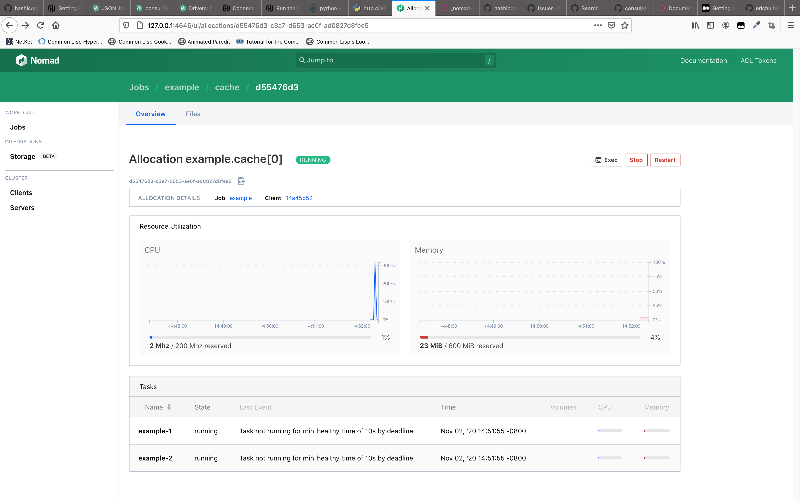
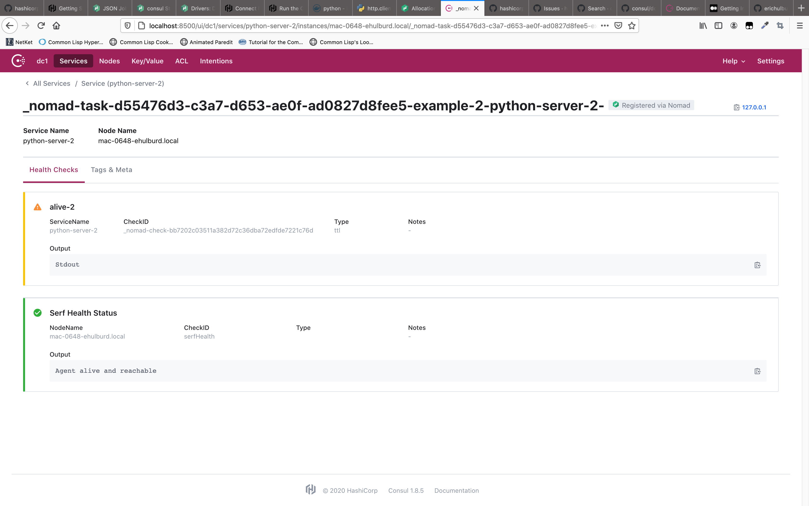

# Run Consul

```shell script
 % consul --version
Consul v1.8.5
Revision 1e03567d3
Protocol 2 spoken by default, understands 2 to 3 (agent will automatically use protocol >2 when speaking to compatible agents)
consul agent -dev
```

# Run Nomad

```shell script
% nomad --version                          
Nomad v0.12.5 (514b0d667b57068badb43795103fb7dd3a9fbea7)
nomad agent -dev
```

# Build docker image and expose as tar

```shell script
docker build . -t example
docker save example -o example.tar
python3 -m http.server 8888
```

# Create Job

```shell script
curl -XPUT -d @job.json http://127.0.0.1:4646/v1/job/example
```

# Issues

* The healthcheck command in the example-2 task throws an exception. However, in the Nomad UI, both tasks are reported as having failed with `Task not running for min_healthy_time of 10s by deadline`.



* The `python-server-2` healthcheck is reported as a warning rather than a failure.


* The `python-server-2` healthcheck output only contains output written to Stdout, not Stderr.


